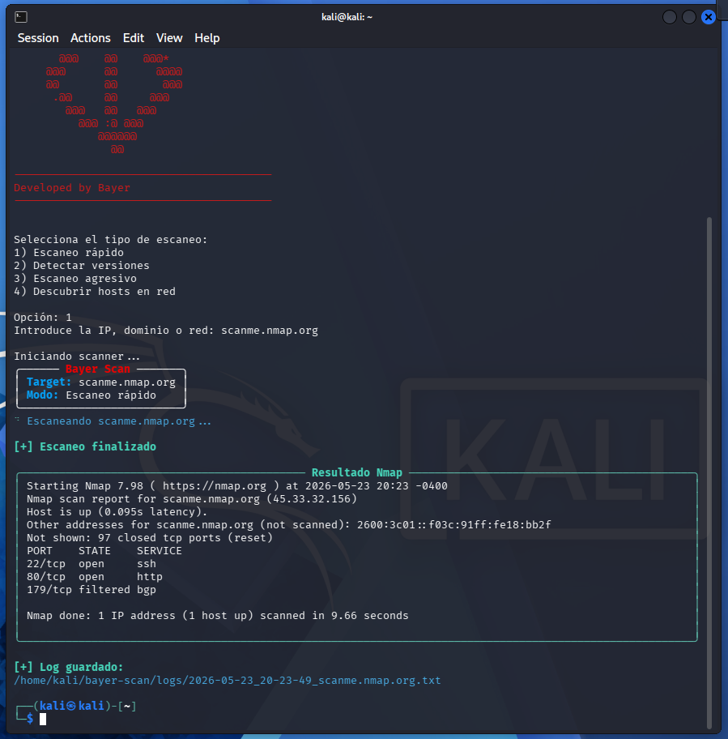
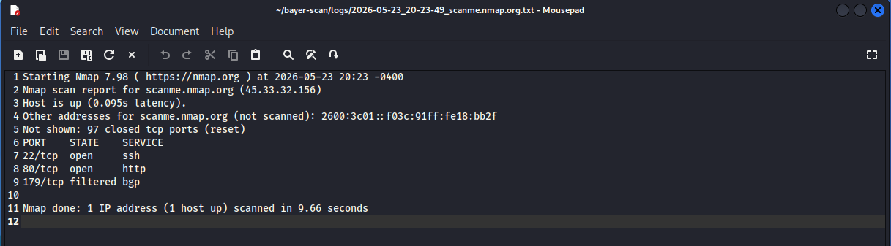

# Bayer Scan


Custom Nmap-based reconnaissance CLI built with Python, Bash and Rich.

## Overview

Bayer Scan is a terminal-based reconnaissance and network scanning tool designed to simplify and automate common Nmap workflows through a clean interactive CLI.

The project combines Bash, Python and Rich to provide an improved terminal experience with automated logging, scan presets and real-time visual feedback.

## Screenshots

### Main Interface


### Quick Scan Example


## Features

* Interactive CLI launcher
* Multiple scan modes
* Automated log generation
* Rich terminal UI
* Timestamped reports
* Automatic report opening
* Colored terminal output
* Nmap integration
* Global command execution

## Scan Modes

| Mode              | Description                                    |
| ----------------- | ---------------------------------------------- |
| Fast Scan         | Quick scan using `nmap -F`                     |
| Version Detection | Service and version detection using `nmap -sV` |
| Aggressive Scan   | Aggressive scan using `nmap -A`                |
| Host Discovery    | Network discovery using `nmap -sn`             |

## Technologies Used

* Python 3
* Bash
* Nmap
* Rich

## Installation

Clone the repository:

```bash
git clone https://github.com/GT-Bayer/bayer-scan.git
cd bayer-scan
```

Install dependencies:

```bash
sudo apt install nmap python3-rich
```

Give execution permissions:

```bash
chmod +x bayer-scan
```

Run the scanner:

```bash
./bayer-scan
```

## Example Usage

```bash
bayer-scan
```

Example target:

```text
scanme.nmap.org
```

## Future Improvements

* Open ports table visualization
* XML/HTML export
* Multi-target scanning
* UDP scanning
* Stealth scan support
* CVE integration
* Network mapping
* Advanced reporting

## Disclaimer

This tool was developed for educational purposes and authorized security testing only.
